# Udactity Data Analyst

## Univariate Visualizations Excercises

### Figures, Axes, and Subplots

These excercises show the basic structure of visualizations using matplotlib and how subplots work in that structure.

The base of a visualization in matplotlib is a `Figure` object. Contained within each Figure will be one or more `Axes` objects, each Axes object containing a number of other elements that represent each plot. 


```python
import pandas as pd
import numpy as np
import matplotlib.pyplot as plt
import seaborn as sb
import random
```


```python
admissions = pd.read_csv('admissions.csv')
admissions.head()
```


<div>
<style scoped>
    .dataframe tbody tr th:only-of-type {
        vertical-align: middle;
    }

    .dataframe tbody tr th {
        vertical-align: top;
    }

    .dataframe thead th {
        text-align: right;
    }
</style>
<table border="1" class="dataframe">
  <thead>
    <tr style="text-align: right;">
      <th></th>
      <th>admit</th>
      <th>gre</th>
      <th>gpa</th>
      <th>prestige</th>
    </tr>
  </thead>
  <tbody>
    <tr>
      <th>0</th>
      <td>0</td>
      <td>380</td>
      <td>3.61</td>
      <td>3</td>
    </tr>
    <tr>
      <th>1</th>
      <td>1</td>
      <td>660</td>
      <td>3.67</td>
      <td>3</td>
    </tr>
    <tr>
      <th>2</th>
      <td>1</td>
      <td>800</td>
      <td>4.00</td>
      <td>1</td>
    </tr>
    <tr>
      <th>3</th>
      <td>1</td>
      <td>640</td>
      <td>3.19</td>
      <td>4</td>
    </tr>
    <tr>
      <th>4</th>
      <td>0</td>
      <td>520</td>
      <td>2.93</td>
      <td>4</td>
    </tr>
  </tbody>
</table>
</div>


```python
plt.hist(data = admissions, x = 'gpa');
```


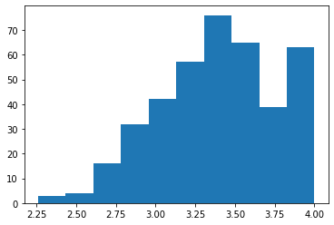


```python
plt.figure(figsize = [10, 5]) # larger figure size for subplots

# example of somewhat too-large bin size
plt.subplot(1, 2, 1) # 1 row, 2 cols, subplot 1
bin_edges = np.arange(2, admissions['gpa'].max()+0.25, 0.5)
plt.hist(data = admissions, x = 'gpa', bins = bin_edges);

# example of correct bin size
plt.subplot(1, 2, 2) # 1 row, 2 cols, subplot 2
bin_edges = np.arange(2, admissions['gpa'].max()+0.25, 0.2)
plt.hist(data = admissions, x = 'gpa', bins = bin_edges);
```


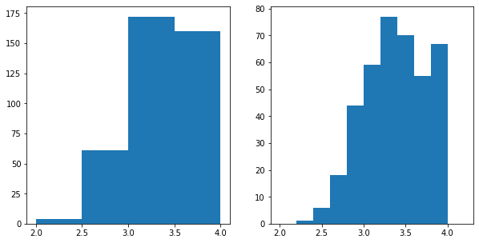


```python
plt.figure(figsize = [10, 5]) # larger figure size for subplots

# example of somewhat too-large bin size
plt.subplot(1, 2, 1) # 1 row, 2 cols, subplot 1
bin_edges = np.arange(2, admissions['gpa'].max()+0.25, 0.5)
plt.hist(data = admissions, x = 'gpa', bins = bin_edges);

# example of correct bin size
# plt.subplot(1, 2, 2) # 1 row, 2 cols, subplot 2
bin_edges = np.arange(2, admissions['gpa'].max()+0.25, 0.2)
plt.hist(data = admissions, x = 'gpa', bins = bin_edges);
```


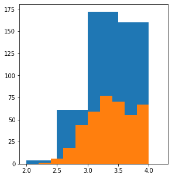


```python
fig, axes = plt.subplots(3, 4) # grid of 3x4 subplots
axes = axes.flatten() # reshape from 3x4 array into 12-element vector
for i in range(12):
    plt.sca(axes[i]) # set the current Axes
    plt.text(0.5, 0.5, i+1) # print conventional subplot index number to middle of Axes
```


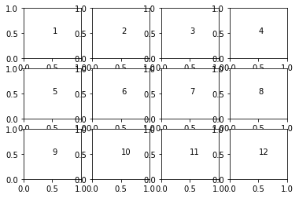


```python
# create a dataframe with 100 entries showing the results of drawing two unbiased dies

two_dies = []
for draw in range(100):
    die1 = random.randint(1, 6)
    die2 = random.randint(1, 6)
    two_dies.append(die1 + die2)
df = pd.DataFrame({'two_dies': pd.Series(two_dies)})
df.head()
```


<div>
<style scoped>
    .dataframe tbody tr th:only-of-type {
        vertical-align: middle;
    }

    .dataframe tbody tr th {
        vertical-align: top;
    }

    .dataframe thead th {
        text-align: right;
    }
</style>
<table border="1" class="dataframe">
  <thead>
    <tr style="text-align: right;">
      <th></th>
      <th>two_dies</th>
    </tr>
  </thead>
  <tbody>
    <tr>
      <th>0</th>
      <td>7</td>
    </tr>
    <tr>
      <th>1</th>
      <td>9</td>
    </tr>
    <tr>
      <th>2</th>
      <td>12</td>
    </tr>
    <tr>
      <th>3</th>
      <td>5</td>
    </tr>
    <tr>
      <th>4</th>
      <td>8</td>
    </tr>
  </tbody>
</table>
</div>


## Choosing a Plot for Discrete Data
If you want to plot a discrete quantitative variable, it is possible to select either a histogram or a bar chart to depict the data.

The histogram is the most immediate choice since the data is numeric, but there's one particular consideration to make regarding the bin edges. Since data points fall on set values, it can help to reduce ambiguity by putting bin edges between the actual values taken by the data. Your readers may not know that values on bin edges end up in the bin to their right, so this can help remove potential confusion when they interpret the plot. Compare the two visualizations of 100 random die rolls below, with bin edges _on_ the values in the left subplot, and bin edges in between values in the right subplot.


```python
plt.figure(figsize = [10, 5])

# histogram on the left, bin edges on integers
plt.subplot(1, 2, 1)
bin_edges = np.arange(2, 12+1.1, 1) # note `+1.1`, see below
plt.hist(df['two_dies'], bins = bin_edges)
plt.xticks(np.arange(2, 12+1, 1));

# histogram on the right, bin edges between integers
plt.subplot(1, 2, 2)
bin_edges = np.arange(1.5, 12.5+1, 1)
plt.hist(df['two_dies'], bins = bin_edges)
plt.xticks(np.arange(2, 12+1, 1));
```


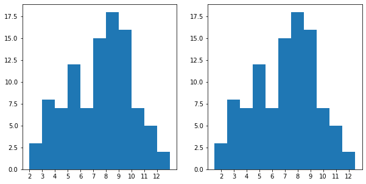


For the left histogram, in a deviation from the examples that have come before, the instructor added 1.1 to the max value (12) for setting the bin edges, rather than just the desired bin width of 1. Data that is equal to the rightmost bin edge gets lumped in to the last bin. This presents a potential problem in perception when a lot of data points take the maximum value, and so is especially relevant when the data takes on discrete values. The 1.1 adds an additional bin to the end to store the die rolls of value 12 alone, to avoid having the last bar catch both 11 and 12.

Alternatively to the histogram, consider if a bar chart with non-connected bins might serve your purposes better. The plot below takes the code from before, but adds the `rwidth` parameter to set the proportion of the bin widths that will be filled by each histogram bar.


```python
bin_edges = np.arange(1.5, 12.5+1, 1)
plt.hist(df['two_dies'], bins = bin_edges, rwidth = 0.7)
plt.xticks(np.arange(2, 12+1, 1));
```


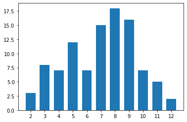


### Descriptive Statistics, Outliers, and Axis Limits

We might need to change the limits or scale of what is plotted to take a closer look at the underlying patterns in the data. In order to change a histogram's axis limits, we can add a Matplotlib `xlim` call to our code. The function takes a tuple of two numbers specifying the upper and lower bounds of the x-axis range. Alternatively, the xlim function can be called with two numeric arguments to the same result.


```python
pokemon = pd.read_csv('pokemon.csv')
pokemon.sample(3)
```


<div>
<style scoped>
    .dataframe tbody tr th:only-of-type {
        vertical-align: middle;
    }

    .dataframe tbody tr th {
        vertical-align: top;
    }

    .dataframe thead th {
        text-align: right;
    }
</style>
<table border="1" class="dataframe">
  <thead>
    <tr style="text-align: right;">
      <th></th>
      <th>id</th>
      <th>species</th>
      <th>generation_id</th>
      <th>height</th>
      <th>weight</th>
      <th>base_experience</th>
      <th>type_1</th>
      <th>type_2</th>
      <th>hp</th>
      <th>attack</th>
      <th>defense</th>
      <th>speed</th>
      <th>special-attack</th>
      <th>special-defense</th>
    </tr>
  </thead>
  <tbody>
    <tr>
      <th>38</th>
      <td>39</td>
      <td>jigglypuff</td>
      <td>1</td>
      <td>0.5</td>
      <td>5.5</td>
      <td>95</td>
      <td>normal</td>
      <td>fairy</td>
      <td>115</td>
      <td>45</td>
      <td>20</td>
      <td>20</td>
      <td>45</td>
      <td>25</td>
    </tr>
    <tr>
      <th>611</th>
      <td>612</td>
      <td>haxorus</td>
      <td>5</td>
      <td>1.8</td>
      <td>105.5</td>
      <td>243</td>
      <td>dragon</td>
      <td>NaN</td>
      <td>76</td>
      <td>147</td>
      <td>90</td>
      <td>97</td>
      <td>60</td>
      <td>70</td>
    </tr>
    <tr>
      <th>763</th>
      <td>764</td>
      <td>comfey</td>
      <td>7</td>
      <td>0.1</td>
      <td>0.3</td>
      <td>170</td>
      <td>fairy</td>
      <td>NaN</td>
      <td>51</td>
      <td>52</td>
      <td>90</td>
      <td>100</td>
      <td>82</td>
      <td>110</td>
    </tr>
  </tbody>
</table>
</div>


```python
plt.figure(figsize = [10, 5])

# histogram on left: full data
plt.subplot(1, 2, 1)
bin_edges = np.arange(0, pokemon['height'].max()+0.5, 0.5)
plt.hist(data = pokemon, x = 'height', bins = bin_edges);

# histogram on right: focus in on bulk of data < 35
plt.subplot(1, 2, 2)
bin_edges = np.arange(0, pokemon['height'].max()+0.2, 0.2)
plt.hist(data = pokemon, x = 'height', bins = bin_edges)
plt.xlim(0, 6); # could also be called as plt.xlim((0, 6))
```


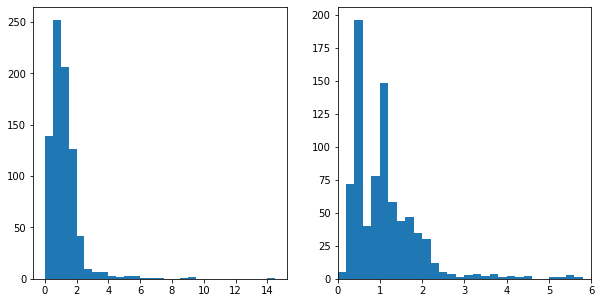


### Scales and Transformations

Certain data distributions will find themselves amenable to scale transformations. The most common example of this is data that follows an approximately log-normal distribution. This is data that, in their natural units, can look highly skewed: lots of points with low values, with a very long tail of data points with large values. However, after applying a logarithmic transform to the data, the data will follow a normal distribution.


```python
bin_edges = np.arange(0, pokemon['weight'].max()+40, 40)
plt.hist(data = pokemon, x = 'weight', bins = bin_edges);
```


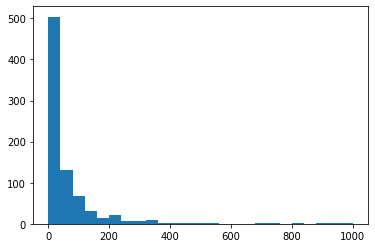


```python
np.log10(pokemon['weight']).describe()
```


    count    807.000000
    mean       1.364366
    std        0.670968
    min       -1.000000
    25%        0.954243
    50%        1.431364
    75%        1.799341
    max        2.999957
    Name: weight, dtype: float64


```python
bin_edges = 10 ** np.arange(-1, 3+0.1, 0.1)
ticks = [0.1, 1, 10, 100, 1000]
lables = ['{}'.format (v) for v in ticks]
plt.hist(data = pokemon, x = 'weight', bins = bin_edges);
plt.xscale('log');
```


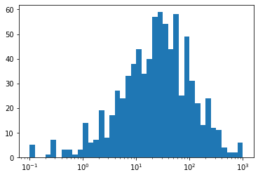


```python
plt.figure(figsize = [10, 5])

# left histogram: data plotted in natural units
plt.subplot(1, 2, 1)
bin_edges = np.arange(0, pokemon['weight'].max()+40, 40)
plt.hist(data = pokemon, x = 'weight', bins = bin_edges);

# right histogram: data plotted after log transformation
plt.subplot(1, 2, 2)
bin_edges = 10 ** np.arange(-1, 3+0.1, 0.1)
# ticks = [0.1, 1, 10, 100, 1000]
lables = ['{}'.format (v) for v in ticks]
plt.hist(data = pokemon, x = 'weight', bins = bin_edges);
# plt.xscale('log');
```


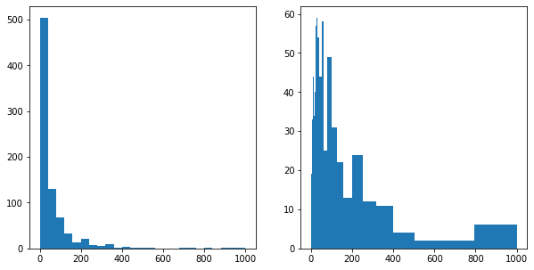


Even though the data is on a log scale, the bins are still linearly spaced. This means that they change size from wide on the left to thin on the right, as the values increase multiplicatively. Secondly, the default label settings are still somewhat tricky to interpret, and are sparse as well.

To address the bin size issue, we just need to change them so that they are evenly-spaced powers of 10. Depending on what we are plotting, a different base power like 2 might be useful instead. For the ticks, we can use `xticks` to specify locations and labels in their natural units. We aren't changing the values taken by the data, only how they're displayed. Between integer powers of 10, we don't have clean values for even markings, but we can still get close. Setting ticks in cycles of 1-3-10 or 1-2-5-10 are very useful for base-10 log transforms.


```python
plt.figure(figsize = [10, 5])

# left histogram: data plotted in natural units
plt.subplot(1, 2, 1)
bin_edges = np.arange(0, pokemon['weight'].max()+40, 40)
plt.hist(data = pokemon, x = 'weight', bins = bin_edges);

# right histogram: data plotted after log transformation
plt.subplot(1, 2, 2)
plt.xscale('log');
bin_edges = 10 ** np.arange(-1, 3+0.1, 0.1)
ticks = [0.1, 0.3, 1, 3, 10, 30, 100, 300, 1000]
lables = ['{}'.format (v) for v in ticks]
plt.hist(data = pokemon, x = 'weight', bins = bin_edges);
```


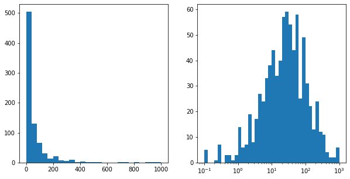


It is important that the `xticks` are specified *after* `xscale` since that function has its own built-in tick settings.

When we perform a logarithmic transformation, our data values have to all be **positive**; it's impossible to take a log of zero or a negative number. 


```python

```
